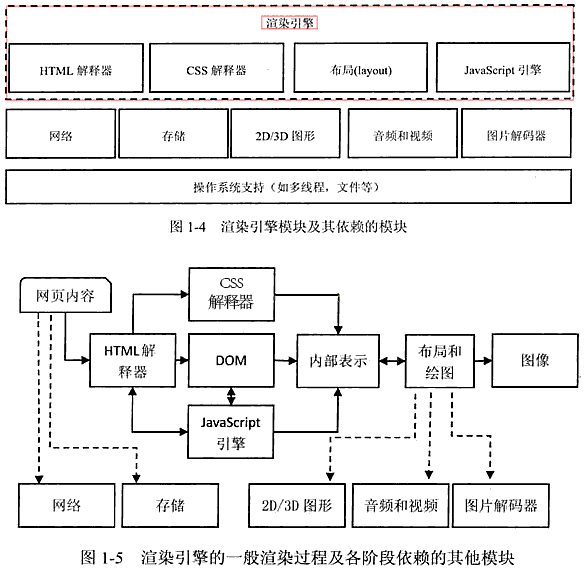

# 浏览器内核
- 1.浏览器最核心的部分就是"Rendering Engine"，就是浏览器内核，负责对网页语法的解释并渲染显示网页。
- 2.渲染引擎及其处理过程：  
  
  **网页内容除去网络请求的内容和需要存储和缓存的内容，交给HTML解释器，分别依赖CSS解释器和DOM解释器形成样式结构体和DOM树，其中遇到js部分交给js引擎，之后样式结构体和DOM树结合成render tree，再由布局模块计算模型内部元素的大小位置，最后由绘图模块完成模型到图像的绘制**
- 3.浏览器内核主要包含三个技术分支：排版渲染引擎、js引擎、其他。
- **4.浏览器内核介绍：**
  - 1.Trident：微软开发的一款排版引擎。
    - 1.IE4诞生时一同出现，是一款开放的内核，该引擎被设计成一个软件模块，现在接口已经很成熟了，所以很多开发人员在自己的应用程序中加入网页的浏览功能
    - 2.是微软在Mosaic代码的基础之上修改而来，并沿用到IE11，在IE Edge中使用chrome的Blink内核，有许多采用IE内核的非IE浏览器（壳浏览器）
    - 3.由于IE的市场占有率很大，Trident内核长期没有得到更新，导致--一是Trident曾经几乎与W3C标准脱节（2005），二是Trident的大量Bug等安全性问题没有得到解决，一些致力于开源的开发者和一些学者公开自己认为IE浏览器不安全的观点，有很多用户转向了其他浏览器，Firefox和Opera就是这个时候兴起的。同时，非Trident内核的浏览器的兴起使很多网页开发人员开始网页标准和非IE浏览器的浏览效果。
    - 4.IE从版本11开始，初步支持WebGL技术。IE8的JavaScript引擎是Jscript，IE9开始用Chakra，这两个版本区别很大，Chakra无论是速度和标准化方面都很出色。
    - 5.其中部分浏览器的新版本是“双核”甚至是“多核”，其中一个内核是Trident，然后再增加一个其他内核。国内的厂商一般把其他内核叫做“高速浏览模式”，而Trident则是“兼容浏览模式”，用户可以来回切换。
    - *6.Trident内核的常见浏览器有：　IE6、IE7、IE8（Trident 4.0）、IE9（Trident 5.0）、IE10（Trident 6.0）；360安全浏览器（1.0-5.0为Trident，6
    .0为Trident+Webkit，7.0为Trident+Blink）猎豹极轻浏览器，360极速浏览器（7.5之前为Trident+Webkit，7.5为Trident+Blink）猎豹安全浏览器（1.0-4
    .2版本为Trident+Webkit，4.3及以后版本为Trident+Blink）猎豹极轻浏览器，傲游浏览器（傲游1.x、2.x为IE内核，3.x为IE与Webkit双核）、百度浏览器（早期版本）、世界之窗浏览器（最初为IE内核，2013年采用Chrome+IE内核）、2345浏览器、腾讯TT、淘宝浏览器、采编读浏览器、搜狗高速浏览器（1.x为Trident，2.0及以后版本为Trident+Webkit）、阿云浏览器（早期版本）、瑞星安全浏览器、Slim Browser、 GreenBrowser、爱帆浏览器（12 之前版本）、115浏览器、155浏览器、闪游浏览器、N氧化碳浏览器、糖果浏览器、彩虹浏览器、瑞影浏览器、勇者无疆浏览器、114浏览器、蚂蚁浏览器、飞腾浏览器、速达浏览器、佐罗浏览器、海豚浏览器（iPhone/iPad/Android）、UC浏览器（Webkit内核+Trident内核）等。*
  - 2.Gecko：Netscape6开始采用的内核，后来的Mozilla FireFox（火狐浏览器） 也采用了该内核。
    - 1.代码完全公开，所以其可开发程度很高，因为是开源内核，所以很多Gecko内核的浏览器，也是市场占有率迅速提高的原因，Gecko还是FireFox用户最多
    - 2.IE没有采用W3C的标准，导致微软内部一些人的不满，他们与当时已经停止更新了的 Netscape的一些员工一起创办了Mozilla，以当时的Mosaic内核为基础重新编写内核，于是开发出了Gecko。
    - 3.Gecko也是一个跨平台内核，可以在Windows、 BSD、Linux和Mac OS X中使用
    - 4.JavaScript引擎是：SpiderMonkey（1.0-3.0）/ TraceMonkey（3.5-3.6）/ JaegerMonkey（4.0）。
    - 5.Gecko内核常见的浏览器：Mozilla Firefox、Mozilla SeaMonkey、waterfox（Firefox的64位开源版）、Iceweasel、Epiphany（早期版本）、Flock（早期版本）、K-Meleon。
  - 3.Presto：Opera12.17及更早版本曾经采用的内核，现已停止开发并废弃，Opera现已改用Google Chrome的Blink内核。
    - 1.该内核在2003年的Opera7中首次被使用，该款引擎的特点就是渲染速度的优化达到了极致，然而代价是牺牲了网页的兼容性
    - 2.实际上这是一个动态内核，与前面几个内核的最大的区别就在脚本处理上，Presto有着天生的优势，页面的全部或者部分都能够在回应脚本事件时等情况下被重新解析。
    - 3.Presto是商业引擎，使用Presto的除开Opera以外，只剩下NDSBrowser、Wii Internet Channle、Nokia 770网络浏览器等，这很大程度上限制了Presto的发展
  - 4.Webkit：Safari浏览器的内核，苹果公司自己的内核
    - 1.Webkit引擎包含WebCore排版引擎及JavaScriptCore解析引擎，均是从KDE的KHTML及KJS引擎衍生而来，它们都是自由软件，在GPL条约下授权，同时支持BSD系统的开发。所以Webkit也是自由软件，同时开放源代码。在安全方面不受IE、Firefox的制约，所以Safari浏览器在国内还是很安全的。
    - 2.safari现在支持windows
    - 3.Google Chrome之前、360极速浏览器以及搜狗高速浏览器高速模式也使用Webkit作为内核（在脚本理解方面，Chrome使用自己研发的V8引擎）。WebKit 内核在手机上的应用也十分广泛，例如 Google 
    的手机 Gphone、 Apple 的iPhone， Nokia’s Series 60 browser 等所使用的 Browser 内核引擎，都是基于 WebKit。
    - 4.WebKit内核常见的浏览器：傲游浏览器3、Apple Safari （Win/Mac/iPhone/iPad）、Symbian手机浏览器、Android 默认浏览器
  - 5.Blink：Google和Opera Software开发的浏览器排版引擎
    - 1.这一渲染引擎是开源引擎WebKit中WebCore组件的一个分支，并且在Chrome（28及往后版本）、Opera（15及往后版本）和Yandex浏览器中使用，最新的IE Edge也使用Blink内核
    - 2.谷歌此举欲降低Webkit即苹果在浏览器市场的影响力，Mozilla与三星也达成合作协议开发“下一代”浏览器渲染引擎Servo。